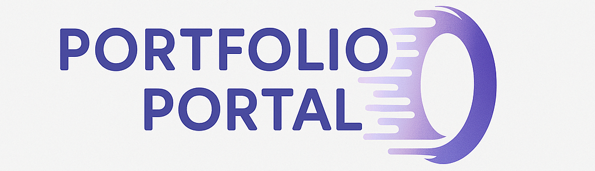

<!-- # Portfolio-Portal

## Project Information

Our team, CtrlFreaks, is developing a 3D portfolio website generator that scans a users CV and generates a custom 3D portfolio website!

## Team Members and Roles

| Name             | Role         | Student Number | Profile                                                                            |
| ---------------- | ------------ | -------------- | ---------------------------------------------------------------------------------- |
| Angelique Breedt | Group Leader | u23542838      | [LinkedIn](https://www.linkedin.com/in/angelique-breedt/)                          |
| Eric Booyens     | Developer    | u05127824      | [LinkedIn](https://www.linkedin.com/in/eric-booyens-60a736353/)                    |
| Keegan Walker    | Developer    | u22693760      | [LinkedIn](https://www.linkedin.com/in/keegan-walker-2144a0324/)                   |
| Nabegh Muhra     | Developer    | u23661268      | [LinkedIn](https://www.linkedin.com/in/nabegh-muhra-222446252/)                    |
| Christopher Yoko | Developer    | u22857941      | [LinkedIn](https://www.linkedin.com/in/chris-yoko-73a79a257/?originalSubdomain=za) |

---

## GitHub Repository Structure

### Git Structure (Mono Repo)

### Git Organisation and Management

Issues are created and assigned to team members who have to implement or fix certain areas of code. These issues are linked to tasks in the projects.

### Branching Strategy

We use the git flow branching strategy. The main branch is used for production-ready versions. The dev branch is where the continuous development occurs, and any other feature is branched off of dev and merged once the feature is complete.

### Issue Tracking

The issues that are created are assigned to team members to complete certain tasks in the project. -->

<h1 align="center">
  
</h1>

  
  
  
  
  

---

## Project Overview

Portfolio Portal is an immersive 3D portfolio website generator developed by team CtrlFreaks.  
It creates interactive, immersive 3D portfolio websites simply by uploading a CV. Template selection algorithms is used to fully render an interactive, dynamic portfolio site. The website is then deployed on the user's localhost for viewing and the user can then share the code used to generate their 3D portfolio!

---

## Links

- [Software Requirements Specification (SRS)](docs/SRS.md)
- [GitHub Project Board](https://github.com/CtrlFreaks/portfolio-portal/projects)

---

## Meet the Team

  

| Name               | Role           | Student Number | Description | Profile | Image |
|--------------------|----------------|----------------|-------------|---------|-------|
| **Angelique Breedt** | Group Leader   | u23542838       | Passionate about project management and design leadership. Experienced in coordinating cross-functional teams and client relations. | [LinkedIn](https://www.linkedin.com/in/angelique-breedt/) |  |
| **Eric Booyens**     | Developer      | u05127824       | Backend-focused developer with a strong grasp of systems, optimization, and concurrency. Loves automation and deep debugging. | [LinkedIn](https://www.linkedin.com/in/eric-booyens-60a736353/) |  |
| **Keegan Walker**    | Developer      | u22693760       | Full-stack developer with a strong eye for frontend interfaces. Enjoys building user-centered designs using React and Tailwind. | [LinkedIn](https://www.linkedin.com/in/keegan-walker-2144a0324/) |  |
| **Nabegh Muhra**     | Developer      | u23661268       | Focused on AI and data-driven features. Excellent at translating real-world logic into algorithms. Great with Python and Node.js. | [LinkedIn](https://www.linkedin.com/in/nabegh-muhra-222446252/) |  |
| **Christopher Yoko** | Developer      | u22857941       | Enthusiastic about 3D graphics and rendering. Loves working with Three.js and building immersive web experiences. | [LinkedIn](https://www.linkedin.com/in/chris-yoko-73a79a257/?originalSubdomain=za) |  |

---

## GitHub Repository Structure

### Git Structure (Mono Repo)

### Git Organisation and Management

Issues are created and assigned to team members who have to implement or fix certain areas of code. These issues are linked to tasks in the projects.

### Branching Strategy

We use the git flow branching strategy. The main branch is used for production-ready versions. The dev branch is where the continuous development occurs, and any other feature is branched off of dev and merged once the feature is complete.

### Issue Tracking

The issues that are created are assigned to team members to complete certain tasks in the project.