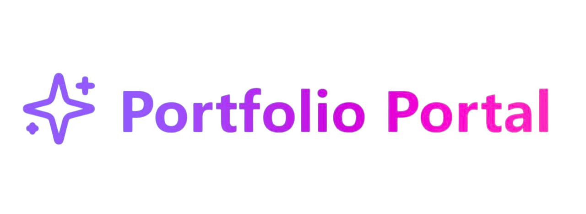

<h1 align="center">
  
</h1>

  
  
  
  
  
  

---

## Project Overview

**Portfolio Portal** is an innovative 3D portfolio website generator created by **team Ctrl Freaks**. With a simple CV upload to the **OCR CV Scanner**, your professional journey is instantly transformed into an **interactive, immersive 3D portfolio**.  

Driven by an **intelligent template selection algorithm**, every portfolio is tailored and brought to life in one of five templates as **dynamic, visually stunning environments**.

✨ **Explore our beautiful 3D templates:**  
- 🚀 **Space** – futuristic and limitless  
- 🏢 **Office** – sleek and professional  
- 🌲 **Forest** – organic and vibrant  
- 🔬 **Lab** – modern and experimental  
- 🕳️ **Cave** – mysterious and atmospheric  

---

## 🔗 Links

## 📚 Documentation

| Document                                         | GitHub (MD)                                         | PDF |
| ------------------------------------------------ | --------------------------------------------------- | --- |
| **Software Requirements Specification (SRS) v4** | [SRS-v4.md](Docs/SRS.md)                            | 📄 [PDF](https://docs.google.com/document/d/1AdkXLw0L0QYuMzKTnngBeQmyf88WLrqCNR6NADljZ8g/export?format=pdf) |
| **Architectural Requirements**                   | [Architecture.md](Docs/ArchitecturalRequirements.md)| 📄 [PDF](https://docs.google.com/document/d/1rxkMraYgFYUdMYmQF_VLTrUnhh7xI9QWVL8zSpGn-2w/export?format=pdf) |
| **Coding Standards**                             | [CodingStandards.md](Docs/CodingStandards.md)       | 📄 [PDF](https://docs.google.com/document/d/1j0fwH4UwJNHiyEn0N_KdP3u124mgLxRNWcVEKuTFRPc/export?format=pdf) |
| **Testing Policy**                               | [TestingPolicy.md](Docs/CodingStandards.md)         | 📄 [PDF](https://docs.google.com/document/d/1UXAOX9HmwBgozpefsD_36RBrdGiVT1ungcakLqp5elg/export?format=pdf) |
| **Project Management**                           | [ProjectManagement.md](https://github.com/orgs/COS301-SE-2025/projects/118) | _N/A_ |
| **User Manual**                                  | [UserManual.md](Docs/UserManual.md)                 | 📄 [PDF](https://docs.google.com/document/d/1xpYEr_gpnPbiTEHjSDPLsoRo8oy0msK5yuGsxLp-_v0/export?format=pdf) |
| **Technical Installation Manual**                | [TechInstallManual.md](Docs/TechnicalInstallation.md)| 📄 [PDF](https://docs.google.com/document/d/1KhyXSj1a-Nh9sYJlSksyh8CfJHQmo1Nhs8T0O-OssVc/export?format=pdf) |
| **Archived Docs**                                | [Docs/Archives/](Docs/Archives/)                    | _N/A_ |

---

## 🎥 Demo Videos

  
<strong>Demo 1</strong>

  - 🎬 [Watch Demo 1 Video](https://youtu.be/gwhL0oYh90Y)  
  - 🖥️ [View Demo 1 Presentation](https://www.canva.com/design/DAGn94hteWs/_gTECzG006hoJGb7K9oaGQ/view?utm_content=DAGn94hteWs&utm_campaign=designshare&utm_medium=link2&utm_source=uniquelinks&utlId=hee3bb8a8c2)

  
<strong>Demo 2</strong>

  - 🎬 [Watch Demo 2 Video](https://m.youtube.com/watch?v=SGc-FlTARXQ)  
  - 🖥️ [View Demo 2 Presentation Slides](https://www.canva.com/design/DAGrPsxEpnk/idI6EzrxXvLiagAmAqmIpQ/edit?utm_content=DAGrPsxEpnk&utm_campaign=designshare&utm_medium=link2&utm_source=sharebutton)

  
<strong>Demo 3</strong>

  - 🎬 [Watch Demo 3 Video](https://drive.google.com/file/d/1XCRL63djTu1q51S68pc_lnhHm-LdyNL6/view?usp=sharing)  
  - 🖥️ [View Demo 3 Presentation Slides](https://www.canva.com/design/DAGv82gdITo/IzhXwJ-SksZ11WxdAxIW9w/edit?utm_content=DAGv82gdITo&utm_campaign=designshare&utm_medium=link2&utm_source=sharebutton)

  
<strong>Demo 4</strong>

  - 🎬 [Watch Demo 4 Video](https://drive.google.com/file/d/11xSkT0_MJJfBVPtdgOl5lh9kuE6pu1N-/view?usp=sharing)  
  - 🖥️ [View Demo 4 Presentation Slides](https://www.canva.com/design/DAGyA7EVHSg/8BEfPfNiJ1l-BFLLcUu14A/edit?utm_content=DAGyA7EVHSg&utm_campaign=designshare&utm_medium=link2&utm_source=sharebutton)

  
<strong>Project Day – Final Demo🎓 </strong>

  - 🎬 [Watch Final Demo Video](https://drive.google.com/file/d/11xSkT0_MJJfBVPtdgOl5lh9kuE6pu1N-/view?usp=sharing)  
  - 🖥️ [View Final Presentation Slides](https://www.canva.com/design/DAG1Uj01HKs/GvFIu1c43-kOnjta3uy2lQ/edit?utm_content=DAG1Uj01HKs&utm_campaign=designshare&utm_medium=link2&utm_source=sharebutton)

---

## 🚀  Deployment of our system:
Our system is live and accessible here:
- 🌐 [Portfolio Portal](https://www.portfolioportal.co.za/)

---

## 📄 CVs to Test With

  
🧑‍💻 Software Developer CV (Space Template)

  

    <a href="https://www.canva.com/design/DAGwJJUnsWY/Fc9LpY75U14T2MQl4B55ug/edit?utm_content=DAGwJJUnsWY&utm_campaign=designshare&utm_medium=link2&utm_source=sharebutton" target="_blank">
      Ava Reynolds
    </a>
  

  
🎨 Artist CV (Forest Template)

  

    <a href="https://www.canva.com/design/DAGwJPuYvf4/sZGZB6l5ZjeSChBuWOpg7w/edit?utm_content=DAGwJPuYvf4&utm_campaign=designshare&utm_medium=link2&utm_source=sharebutton" target="_blank">
      Alex Omari
    </a>
  

  
💼 Finance Manager CV (Office Template)

  

    <a href="https://www.canva.com/design/DAGwJKtX6QE/csYznEg-pY2vf-FpFJaPfw/edit?utm_content=DAGwJKtX6QE&utm_campaign=designshare&utm_medium=link2&utm_source=sharebutton" target="_blank">
      Daniel Brooks
    </a>
  

  
⚕️ Medical Assistant CV (Lab Template)

  

    <a href="https://www.canva.com/design/DAGwT8dRXzM/hu0--roX3m688uxQICh0NA/edit?utm_content=DAGwT8dRXzM&utm_campaign=designshare&utm_medium=link2&utm_source=sharebutton" target="_blank">
      Gabriel Martinez
    </a>
  

  
⛏️ Mining Engineer CV (Cave Template)

  

    <a href="https://www.canva.com/design/DAGwfwnQPWg/fLqTxsrCfIUBQ68BdGYUjQ/edit?utm_content=DAGwfwnQPWg&utm_campaign=designshare&utm_medium=link2&utm_source=sharebutton" target="_blank">
      Brian Park
    </a>
  

---

## 👨‍💻 Technology Stack

### 🔷 Frontend

  
  &nbsp;&nbsp;
  
  &nbsp;&nbsp;
  

### 🟩 Backend

  
  &nbsp;&nbsp;
  
  &nbsp;&nbsp;
  
  &nbsp;&nbsp;
  

### 🚀 Project Management & Deployment

  
  &nbsp;&nbsp;
  
  &nbsp;&nbsp;
  

---

## 👥 Meet the Team

  
<strong>Angelique Breedt</strong> - Group Leader + Developer

**Description:**  
I am a BSc Computer Science student working as group leader for CTRL Freaks on the PortfolioPortal system. I am responsible for ensuring the group is on track and that tasks are accurately delegated. I am also responsible for communication with the client and AL mentor. My focus is on the backend development.

**Profiles:**  
 

  
<strong>Eric Booyens</strong> - Developer

**Description:**  
I am in my third year of studying BSc Computer Science with statistics electives at the University of Pretoria. My strengths include my strong work ethic, my willingness and ability to learn, my problem solving skills, and my charming looks. My focus is on the backend development.

**Profiles:**  
 

  
<strong>Keegan Walker</strong> - Developer

**Description:**  
I am in my last year of study as a motivated BSC Information and Knowledge Systems student. I am an experienced full-stack developer with a broad programming knowledge in Angular, Ionic, JavaScript and Python. My specialty is database systems, such as PostgreSQL and I am eager to create technology that enriches the user experiences.

**Profiles:**  
 

  
<strong>Nabegh Muhra</strong> - Developer

**Description:**  
I’m a third-year Information and Knowledge Systems student with strong full-stack development experience. I’ve built clean, responsive front ends using React and handled everything from routing to authentication and database integration on the back end with Node.js, Express, Vue and MongoDB. I’m comfortable working with Git, Docker, and deploying real-world applications.

**Profiles:**  
 

  
<strong>Christopher Yoko</strong> - Developer

**Description:**  
I am a BSc Information and Knowledge Systems student with a strong background in design and frontend development. I currently work part-time as a web designer, where I focus on creating intuitive and visually engaging user interfaces.

**Profiles:**  
 

---

## GitHub Repository Structure

### Git Structure (Mono Repo)

### Git Organisation and Management

Issues are created and assigned to team members who have to implement or fix certain areas of code. These issues are linked to tasks in the project.

### Branching Strategy

We use the **git flow** branching strategy. The `main` branch is used for production-ready versions. The `dev` branch is where continuous development occurs. Features are branched off of `dev` and merged once complete.

### Issue Tracking

Issues are created and tracked on GitHub Projects. Each issue is linked to a developer and typically represents a discrete feature, bug fix, or documentation task.
