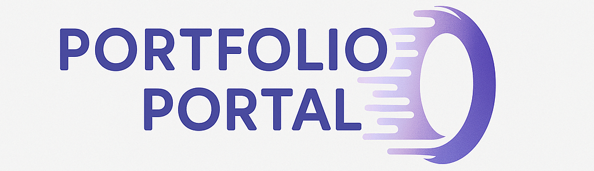
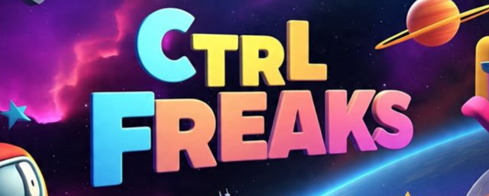

<h1 align="center">
  
</h1>

  
  
  
  
  

---

## Project Overview

Portfolio Portal is an immersive 3D portfolio website generator developed by team CtrlFreaks.  
It creates interactive, immersive 3D portfolio websites simply by uploading a CV. Template selection algorithms are used to fully render an interactive, dynamic portfolio site. The website is deployed on the user's localhost for viewing, and the user can then share the code used to generate their 3D portfolio.

---

## 🔗 Links

## 📚 Documentation

| Document | GitHub (MD) | Google Docs |
|----------|-------------|-------------|
| **Software Requirements Specification (SRS) v1** | [SRS-v1.md](Docs/Archives/SRS-v1.0.md) | _N/A_ |
| **Software Requirements Specification (SRS) v2** | [SRS-v2.md](Docs/SRS-v2.0.md) | [Google Doc](https://docs.google.com/document/d/1YuFVzTCzYVBHjqC2GIN7uIED1_1ScgQXl-vynpJZYWY/edit?usp=sharing) |
| **Architectural Requirements** | [Architecture.md](Docs/Architecture.md) | [Google Doc](https://docs.google.com/document/d/1rxkMraYgFYUdMYmQF_VLTrUnhh7xI9QWVL8zSpGn-2w/edit?usp=sharing) |
| **User Manual** | [UserManual.md](Docs/UserManual.md) | [Google Doc](https://docs.google.com/document/d/1xpYEr_gpnPbiTEHjSDPLsoRo8oy0msK5yuGsxLp-_v0/edit?usp=sharing) |
| **Coding Standards** | [CodingStandards.md](Docs/CodingStandards.md) | [Google Doc](https://docs.google.com/document/d/1j0fwH4UwJNHiyEn0N_KdP3u124mgLxRNWcVEKuTFRPc/edit?usp=sharing) |
| **Archived Docs** | [Docs/Archives/](Docs/Archives/) | _N/A_ |
| **Server README** | [server/README.md](server/README.md) | _N/A_ |
| **Frontend README** | [frontend/README.md](frontend/README.md) | _N/A_ |

---

## 🎥 Demo 1

- [Demo 1 Video](https://youtu.be/gwhL0oYh90Y)
- [Demo 1 Presentation Slides](https://www.canva.com/design/DAGn94hteWs/_gTECzG006hoJGb7K9oaGQ/view?utm_content=DAGn94hteWs&utm_campaign=designshare&utm_medium=link2&utm_source=uniquelinks&utlId=hee3bb8a8c2)

---

## 🎥 Demo 2

- [Demo 2 Video](https://youtu.be/gwhL0oYh90Y)
- [Demo 2 Presentation Slides](https://www.canva.com/design/DAGrPsxEpnk/idI6EzrxXvLiagAmAqmIpQ/edit?utm_content=DAGrPsxEpnk&utm_campaign=designshare&utm_medium=link2&utm_source=sharebutton)

---

## 👨‍💻 Technology Stack

### 🔷 Frontend

  
  &nbsp;&nbsp;
  
  &nbsp;&nbsp;
  

---

### 🟩 Backend

  
  &nbsp;&nbsp;
  
  &nbsp;&nbsp;
  
  &nbsp;&nbsp;
  

---

### 🚀 Project Management & Deployment

  
  &nbsp;&nbsp;
  
  &nbsp;&nbsp;
  

---

## 👥 Meet the Team

  

| Name                 | Role           | Student Number | Description | LinkedIn |
|----------------------|----------------|----------------|-------------|----------|
| **Angelique Breedt** | Group Leader   | u23542838       | I am a BSc Computer Science student working as group leader for CTRL Freaks on the PortfolioPortal system. I am responsible for ensuring the group is on track and that tasks are accurately delegated. I am also responsible for communication with the client and AL mentor. My focus is on the backend development. | [LinkedIn](https://www.linkedin.com/in/angelique-breedt/) |
| **Eric Booyens**     | Developer      | u05127824       | I am in my third year of studying BSc Computer Science with statistics electives at the University of Pretoria. My strengths include my strong work ethic, my willingness and ability to learn, my problem solving skills, and my charming looks. My focus is on the backend development. | [LinkedIn](https://www.linkedin.com/in/eric-booyens-60a736353/) |
| **Keegan Walker**    | Developer      | u22693760       | I am in my last year of study as a motivated BSC Information and Knowledge Systems student. I am an experienced full-stack developer with a broad programming knowledge in Angular, Ionic, JavaScript and Python. My specialty is database systems, such as PostgreSQL and I am eager to create technology that enriches the user experiences. | [LinkedIn](https://www.linkedin.com/in/keegan-walker-2144a0324/) |
| **Nabegh Muhra**     | Developer      | u23661268       | I’m a third-year Information and Knowledge Systems student with strong full-stack development experience. I’ve built clean, responsive front ends using React and handled everything from routing to authentication and database integration on the back end with Node.js, Express, Vue and MongoDB. I’m comfortable working with Git, Docker, and deploying real-world applications. | [LinkedIn](https://www.linkedin.com/in/nabegh-muhra-222446252/) |
| **Christopher Yoko** | Developer      | u22857941       | I am a BSc Information and Knowledge Systems student with a strong background in design and frontend development. I currently work part-time as a web designer, where I focus on creating intuitive and visually engaging user interfaces. | [LinkedIn](https://www.linkedin.com/in/chris-yoko-73a79a257/?originalSubdomain=za) |

---

## GitHub Repository Structure

### Git Structure (Mono Repo)

### Git Organisation and Management

Issues are created and assigned to team members who have to implement or fix certain areas of code. These issues are linked to tasks in the project.

### Branching Strategy

We use the **git flow** branching strategy. The `main` branch is used for production-ready versions. The `dev` branch is where continuous development occurs. Features are branched off of `dev` and merged once complete.

### Issue Tracking

Issues are created and tracked on GitHub Projects. Each issue is linked to a developer and typically represents a discrete feature, bug fix, or documentation task.
